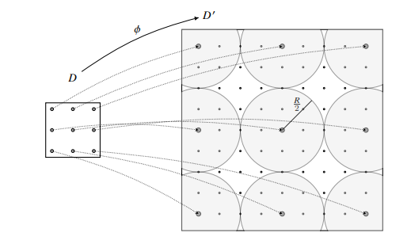
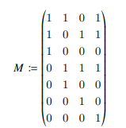
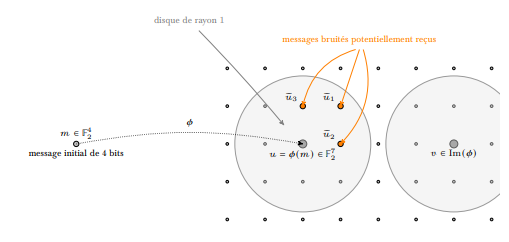

# **Consignes projet BUT1 SAE1.2**

## BUT1 – S.A.E. S1-02 <br>COMMUNIQUER, EN TOUTE SÉCURITÉ

<br>

### IUT DE NANTES – DÉPARTEMENT D’INFORMATIQUE – 2021  

<br>

Le but de ce projet, en trois parties, est de comprendre deux outils mathématiques qui entre en jeu lors de communications sécurisées en ligne

1. La première partie se concentre sur le chiffrage et le déchiffrage d’informations avec un système de clé publique et clé privée. Concernant cette partie, vous aurez un certain nombre de fonctions Python à réaliser pour mettre en œuvre le chiffrage et le déchiffrage d’un message.
2. La seconde partie est une introduction à la notion de code correcteur. On se concentre sur un exemple simple, dont il faudra illustrer les propriétés. Notez que bien qu’il n’y soit pas explicitement question de code en Python, rien ne vous empêche d’en utiliser, cela étant même fortement encouragé.
3. La dernière partie est une mise en œuvre simultanée de ces deux outils afin de simuler comment a lieu une communication sécurisée en ligne.

Vous travaillerez en binôme. Vous devrez avoir rendu votre travail avant le Vendredi 17 décembre 2021, à 23h59 afin de partir en vacances l’esprit tranquille. Pour cela, vous déposerez sur Madoc quatre fichiers :
* un fichier `SAE_S1_02_RSA.py` qui contiendra l’ensemble de votre code python concernant la partie cryptographie
* un fichier `SAE_S1_02_Corr.py` qui contiendra l’ensemble de votre code python concernant la partie code correcteur
* un fichier `SAE_S1_02_Bilan.py` qui contiendra l’ensemble de votre code python concernant la dernière partie de ce projet ; il pourra faire appel aux aux deux précedents fichiers
* un fichier `rapport.pdf` d’au maximum cinq pages qui contiendra l’ensemble des explications, justifications exigées ; ce fichier devra également contenir les noms du binôme

Vous ne ferez qu’un dépot sur Madoc par binôme. Une partie de la note de cette SAÉ sera une
évaluation d’anglais. Pour cette SAÉ, vous disposerez de plusieurs séances pour un total de 12h
encadré par un enseignant du département qui pourra vous guider, répondre à vos questions lors
de votre travail.

<br>

## Partie 1 – Cryptographie : le chiffrement RSA

1. **Principe du chiffrement RSA.** On considère la situation suivante. Deux personnes, Alice (A) veut communiquer à Bob (B) des informations secrètes par internet. Malheureusement, une troisième personne, Eve (E comme espion ...) veut récupérer ces informations confidentielles à son compte. Malheureusement pour Eve, Alice connaît quelques techniques de chiffrement, notamment le chiffrement RSA (RSA pour Rivest, Shamir et Adleman, les trois inventeurs de ce chiffrement). Le fonctionnement du chiffrement RSA, basé sur des résultats d’arithmétique modulaire, est le suivant.
<br><br>§ Asymétrie. Le chiffrement RSA est asymétrique : il utilise une paire de clés (des nombres entiers) composée d’une clé publique pour chiffrer et d’une clé privée pour déchiffrer des données confidentielles. Les deux clés sont créées par une personne, souvent nommée par convention Alice, qui souhaite que lui soient envoyées des données confidentielles (un message envoyé sera sous la forme d’un nombre entier). Alice rend la clé publique accessible. Cette clé est utilisée par ses correspondants (Bob, etc.) pour chiffrer les données qui lui sont envoyées. La clé privée est quant à elle réservée à Alice, et lui permet de déchiffrer ces données. Le fonctionnement du chiffrement RSA est basé sur la diffculté d’exprimer de grands entiers comme produits d’entiers.
<br><br>§ Création des clés. L’étape de création des clés est à la charge d’Alice.
* Elle choisit deux nombres premiers *p* et *q* et calcule le module de chiffrement *n* = *p**q* (les entiers envoyés par messages devront être inférieurs à *n* (à noter que la sécurité du chiffrage repose sur le fait que *p* et *q* soient grands)
 * Elle calcule *φ*(*n*) = (*p* − 1) (*q* − 1), soit la valeur de l’indicatrice d’Euler en *n*. Vous démontrerez cette égalité dans votre rapport en partant de la définition qui suit : la fonction indicatrice d’Euler associe à tout entier naturel *n* non nul le cardinal, noté *φ*(*n*), de l’ensemble des nombres naturels non nuls inférieurs ou égaux à *n* et premiers avec *n*).
 * Elle cherche un nombre entier *e* tel que *e* ∧ *φ*(*n*) = 1 où le symbole ∧ désigne le pgdc (ainsi pgdc(*a*, *b*) = *a* ∧ *b* pour tous nombres *a* et *b*). Le nombre *e* est appelé exposant de chiffrement et le couple (*n*, *e*) constitue la clé publique d’Alice.
 * Elle cherche ensuite l’unique nombre entier *d* inverse de *e* modulo *φ*(*n*) et strictement inférieur à *φ*(*n*) (l’existence de *d* tient au fait que *e* ∧ *φ*(*n*) = 1 et on peut le déterminer grâce à l’algorithme d’Euclide étendu pour obtenir l’identité de Bézout (Alice a besoin pour l’obtenir de *φ*(*n*) = (*p*−1) (*q*−1) et donc de *p* et *q* qui ne sont connus que d’elle). Le nombre *d*, appelé exposant de déchiffrement, constitue la clé privée.
<br><br>§ Chiffrement du message. On note *M* le message que souhaite envoyer Bob. *M* est un entier naturel strictement inférieur à *n*. Le message chiffré sera représenté par l’entier naturel *C* strictement inférieur à *n* et tel que : *M*<sup>*e*</sup> ≡ *C*[*n*] .
<br><br>§ Déchiffrement du message. Pour déchiffrer *C*, on utilise *d*, car on peut montrer que : *M* ≡ *C*<sup>*d*</sup> [*n*] .
<br><br>§ Justiffcation. On veut montrer que *M*<sup>*ed*</sup> ≡ *M*[*n*] . Le nombre *d* étant l’inverse de *e* modulo *φ*(*n*), on en déduit qu’il existe un nombre entier *k* tel que *ed* = 1 + *k* *φ*(*n*) ou encore *ed* = 1 + *k* (*p* − 1) (*q* − 1). On a alors : *M*<sup>*ed*</sup> ≡ *M*<sup>1 + *k* ( *p*−1)(*q*−1)</sup>.
<br><br>
On envisage à présent deux premiers cas :
* Si *M* n’est pas un multiple de *p* alors, d’après le petit théorème de Fermat, on a *M* <sup>*p*−1</sup> ≡ 1[*p*] . En exprimant *M<sup>1+*k* ( *p*−1) (*q*−1)</sup> comme *M* × (*M* <sup>*p*−1</sup>) <sup>*k* (*q*−1)</sup>, on obtient que *M*<sup>*ed*</sup> ≡ *M*[*p*] .
* De manière identique si *M* n’est pas un multiple de *q* alors on a *M* <sup>*q*−1</sup> ≡ 1[*q*] . En exprimant *M* <sup>1+*k* ( *p*−1) (*q*−1)</sup> comme *M* × (*M* <sup>*q*−1</sup>) <sup>*k* ( *p*−1)</sup>, on obtient finalement que *M*<sup>*ed*</sup> ≡ *M*[*q*].
<br><br>Ces deux égalités sont en fait vérifiées pour tout entier *M*. En effet, si *M* est multiple de *p*,
alors *M* et toutes ses puissances avec un exposant non nul sont congrues à 0 modulo *p* (donc
*M*<sup>*ed*</sup> ≡ *M*[*p*]). On obtient de même que si *M* est multiple de *q*, alors *M*<sup>*ed*</sup> ≡ *M*[*q*]. L’entier *M*<sup>*ed*</sup>−*M* est donc un multiple de *p* et de *q*, qui sont des nombres premiers distincts donc premiers entre eux. Le nombre *M**e**d* − *M* est donc également multiple de leur produit *pq* = *n* par une conséquence du théorème de Gauss. On a donc bien démontré que *M*<sup>*ed*</sup> ≡ *M*[*n*].
<br><br>
2. **Attendus pour cette partie.** Vous devez rédiger un ensemble de fonctions permettant la générations des clés publique et privée, le chiffrement d’un message écrit (une chaîne de caractères ne contenant ni caractère accentué, ni majuscule ni ponctuation).
<br><br>Vous devrez rédiger les fonctions suivantes :
    1. Une fonction `list_prime(n)` qui renvoie l’ensemble des nombres premiers inférieurs ou égaux à *n*.
    2. Une fonction `extended_gcd(a,b)` qui prend en entrée 2 entiers *a* et *b* et qui retourne trois entiers *d*, *u*, *v* tels que *au* + *bv* = *d*.
    3. Une fonction `key_creation()`, créant une clé publique et une clé privée (n,pub,priv) grâce à deux nombres premiers *p* et *q* choisis aléatoirement entre 2 et 1000 en interne dans la fonction.
    4.  Une fonction `encryption(n,priv,msg)` qui prend en entrée la clé publique (n,pub) et un message texte msg et qui renvoie le message chiffré (qui pourra prendre la forme d’une liste de nombres).
    <br>
    Pour cela, vous pourrez notamment utiliser une fonction `convert_msg(msg)` codée par vos soins qui transforme le message textuel msg en une liste de nombres, qui seront ensuite chacun chiffrés. Pour transformer le message textuel, vous pourrez notamment utiliser la table ascii pour traduire chaque caractère en une suite de trois chiffres. (Pour chiffrer le message, on veillera à ne pas le faire caractère par caractère, car un tel chiffrage ne résiste pas à une analyse fréquentielle. Nous aurons peut être l’occasion d’en parler plus tard dans l’année.)
    5. Une fonction `decryption(n,pub,msg)` qui prend en entrée la clé privée (n priv) et un message chiffré msg et qui renvoie le message décrypté.

<br>

## Partie 2 - Codes correcteurs

Lors de la communication de l’information en ligne de Bob vers Alice, il se peut que celle-ci soit perturbée, bruitée par un phénomène quelconque. Ainsi, une suite de bits 11011101 au départ peut être reçue comme 11010101 (il y a un bit de différence). Ainsi, comment Alice peut-elle savoir que le message que lui a envoyé Bob est réellement celui qu’il a reçu. Heureusement, Alice sait que l’on peut palier à ce genre de problème, en utilisant des codes correcteurs. L’idée d’un code correcteur est mathématiquement assez simple. On commence par en faire une présentation informelle. On considère *D* (comme dictionnaire) l’ensemble des mots que l’on veut pouvoir communiquer. Un code correcteur est la donnée d’une application injective *Φ*: *D* → (*D*' , *d*) où *D*' est un ensemble "plus grand" que *D*, munie d’une distance *d* : *D*' × *D*' → ℝ de telle sorte qu’il existe un réel *R* > 1 tel que, pour tous mots *m*<sub>1</sub>, *m*<sub>2</sub> ∈ *D*, alors *d*(*Φ*(*m*), *Φ*(*m*')) > *R*. On représente cela par la figure suivante, où les ensembles *D* et *D*' sont représentés par des carrées, les points à l’intérieur de ceux-ci représentant les éléments de ces ensembles.
<br><br>

<br><br>
Dans la suite, on *ω*va s’intéresser aux codes correcteurs linéaires qui sont appelés ainsi car les ensembles de mots *D* et *D*' seront des ensembles de vecteurs (formellement des espaces vectoriels) et l’application *Φ* sera codée par une matrice (formellement une application linéaire de *D* vers *D*').

1. **Une structure mathématique.** On appelle 𝔽<sub>2</sub>, l’ensemble ℤ/2ℤ = {0, 1}. Comme vous l’avez vu lors du semestre, 𝔽<sub>2</sub> est ce qu’on appelle un corps (il est muni d’une addition et d’une multiplication telle que tous les éléments non nuls soient inversibles pour la multiplication : 1 est son propre inverse ici.)
<br><br>Vous répondrez aux questions suivantes :
    1. Décrire les tables de l’addition et de multiplication de 𝔽<sub>2</sub>. <br>Considérons un entier *n* ∈ ℕ* : on peut alors construire l’ensemble 𝔽<sub>2</sub><sup>*n*</sup> des *n*-uplets de 𝔽<sub>2</sub>. Cet ensemble est muni d’une somme : pour *u* = (*ε*<sub>1</sub>, . . . , *ε*<sub>*n*</sub>) et *v* = (*µ*<sub>1</sub>, . . . , *µ*<sub>*n*</sub>), on a *u* + *v* = (*ε*<sub>1</sub>, . . . , *ε*<sub>*n*</sub>) + (*µ*<sub>1</sub>, . . . , *µ*<sub>*n*</sub>) := (*ε*<sub>1</sub> + *µ*<sub>1</sub>, . . . , *ε*<sub>*n*</sub> + *µ*<sub>*n*</sub>) et d’un produit par un scalaire : pour *λ* ∈ 𝔽<sub>2</sub> et *u* = (*ε*<sub>1</sub>, . . . , *ε*<sub>*n*</sub>), on a *λ* · *u* = *λ* · (*ε*<sub>1</sub>, . . . , *ε*<sub>*n*</sub>) = (*λ* · *ε*<sub>1</sub>, . . . *λ* · *ε*<sub>*n*</sub>) (on a donc une structure de 𝔽<sub>2</sub>-espace vectoriel sur 𝔽<sub>2</sub><sup>*n*</sup> , structure similaire à celle sur ℝ<sup>*n*</sup> évoquée en cours). On suppose à présent que l’ensemble des données que l’on veut transmettre peut s’écrire grâce à des éléments de 𝔽<sub>2</sub><sup>*n*</sup> . Dans la suite de cette section, on va considérer le cas où *n* = 4. On suppose donc que l’information que l’on veut transmettre peut se transmettre par des suites de 4 bits : notre premier ensemble *D* est donc *D* = 𝔽<sub>2</sub><sup>4</sup>.<br><br>
    2. On considère les vecteurs e1 = (1, 0, 0, 0), e2 = (0, 1, 0, 0), e3 = (0, 0, 1, 0) et e4 = (0, 0, 0, 1). Montrer que tout vecteur de 𝔽<sub>2</sub><sup>4</sup> peut s’écrire comme une somme de vecteurs *e*<sub>*i*</sub> . On pourra, par exemple, chercher à résoudre un système linéaire, ou alors exhiber l’ensemble des différents vecteurs obtenus par combinaison des *e*<sub>*i*</sub> et comparer cet ensemble avec 𝔽<sub>2</sub><sup>4</sup> . On va construire notre code correcteur linéaire. On doit donc choisir un nombre *m* > 4 et une application injective *Φ*: 𝔽<sub>2</sub><sup>4</sup> → 𝔽<sub>2</sub><sup>*m*</sup> . Afin d’avoir le code le plus performant possible, ces choix ne sont pas laissés au hasard. On prendra donc *m* = 7 et l’application linéaire *Φ*: 𝔽<sub>2</sub><sup>4</sup> → 𝔽<sub>2</sub><sup>7</sup> sera codé par la matrice
    <br><br>
    (ainsi, pour tout v ∈ 𝔽<sub>2</sub><sup>4</sup>, on a *Φ*(v) = *M* · v)<br><br>
    3. Déterminer l’ensemble des vecteurs de l’image de *Φ*. On rappelle que l’image de *Φ* est l’ensemble suivant : Im(*Φ*) {y ∈ 𝔽<sub>2</sub><sup>4</sup> | ∃v ∈ 𝔽<sub>2</sub><sup>4</sup> , *Φ*(v) = y}.
    <br>On pourra chercher à résoudre un système linéaire ou alors à exhiber la liste des vecteurs de Im(*Φ*). Ainsi, notre ensemble Im(*Φ*) forme notre ensemble *D*' . Alice décide d’utiliser ce code correcteur pour communiquer avec Bob. Ainsi, pour communiquer un message de 4 bits à Alice, Bob va devoir envoyer 7 bits d’information. Mais reste une question : pourquoi est-ce bien un code correcteur ? Si le message de 7 bits est bruité pendant l’envoi, comment déterminer le message initial ?
<br><br>
1. **Correction d’un message bruité**. Dans la suite, nous allons voir que si le message de Bob est altéré d’ un bit sur les sept, alors Alice pourra déterminer le message initial. Ainsi, si Bob envoie 1101001 et que Alice reçoit 1111001 alors elle sera capable de retrouver le message initial. Pour cela, introduisons de nouveau quelques objets mathématiques. On appelle poids d’un vecteur v ∈ 𝔽<sub>2</sub><sup>4</sup> le nombre de coeffcient non nuls de celui-ci. On note par *ω* : 𝔽<sub>2</sub><sup>4</sup> → ℕ l’application qui à un vecteur associe son poids. Par exemple, le vecteur v = (1, 0, 0, 1, 1, 0, 1) =est de poids 4, autrement dit, *ω*(v) = 4. Grâce à cette notion de poids, on définit de la manière suivante une distance *d* sur 𝔽<sub>2</sub><sup>4</sup> . Pour deux vecteurs u, v ∈ 𝔽<sub>2</sub><sup>4</sup> , la distance entre u et v est donnée par *d*(u, v) := *ω*(u + v).
<br><br>Vous répondrez aux questions suivantes :
    1. Montrer que pour tous vecteurs u ≠ v de Im(*Φ*), alors *d*(u, v) ≥ 3 . Supposons à présent que u ∈ Im(*Φ*) ⊂ 𝔽<sub>2</sub><sup>4</sup> soit le vecteur qui représente le message envoyé par Bob, et que *ũ* ∈ 𝔽<sub>2</sub><sup>4</sup> soit le vecteur qui représente le message reçu par Alice (donc u et *ũ* ont au minimum six composantes égales), alors, pour tout v ∈ Im(*Φ*), v ≠ u, on a *d*(u, *ũ*) < *d*(v, *ũ*) ; (Remarquez que l’inégalité est stricte) autrement dit, le vecteur u est le vecteur le plus proche de *ũ* appartenant à Im(*Φ*). On peut illustrer cela par la figure ci-dessous.
    <br><br>
    
    <br><br>
    2. Montrer le résultat précédent et expliquer que si Alice est sûr que le message de Bob n’a été bruité qu’au maximum sur un bit, alors Alice peut corriger cette erreur. 
    <br>
    Remarques :
        1. En réalité, il existe une méthode très rapide pour trouver le bit où se situe l’erreur, qui repose notamment sur ce choix particulier de matrice *M*. Mais on ne cherchera pas à déterminer cette méthode ici.<br><br>
        2. Si jamais il y a deux erreurs ou plus dans la transmission de 7 bits, alors notre code ne permet pas de les corriger, ni même de les détecter. Il faudra pour cela améliorer notre code correcteur.

<br>

## Partie 3 – Communication sécurisée

Pour finir, vous illustrerez comment peuvent être mis en œuvre le chiffrement RSA de la section 1 et le code correcteur linéaire présenté dans la section 2. Cette illustration prendra la forme d’un programme python, qui, partant d’un message textuel que veut envoyer Bob, affchera l’état du message à chaque étape (traduction en nombres, chiffrement, traduction en binaire, envoi avec du bruit, débruitage, déchiffrement, affchage du message final)
Vous devrez notamment utiliser la fonction suivante, qui simule du bruit sur un message de 7 bits que votre code correcteur devrait savoir corriger.

```python
def noise(vect_msg):
    """
    prend un vecteur vect_msg et renvoie ce vecteur potentiellement bruite
    """
    
    ### on fait une copie du vecteur initial
    vect = vect_msg.copy()
    
    ### une chance sur quatre de ne pas bruiter le vecteur
    test = np.random.randint(0,4)
    
    if test>0:
        index = np.random.randint(0,np.size(vect))
        vect[index] = (vect[index] +1)%2

    return vect
```
